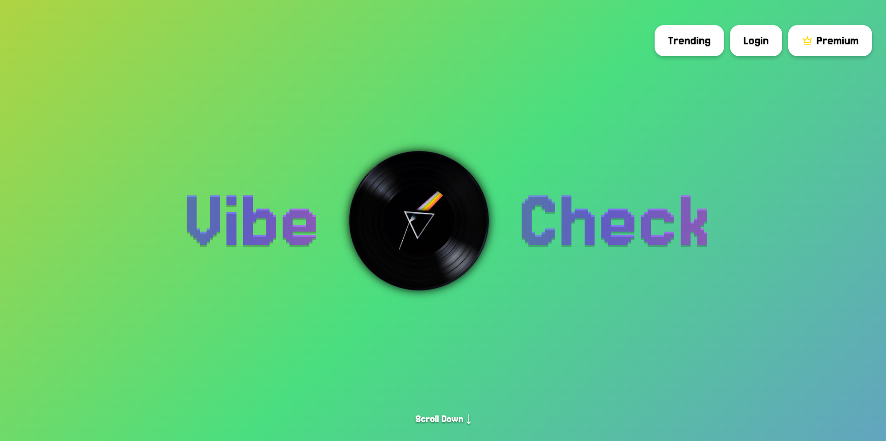
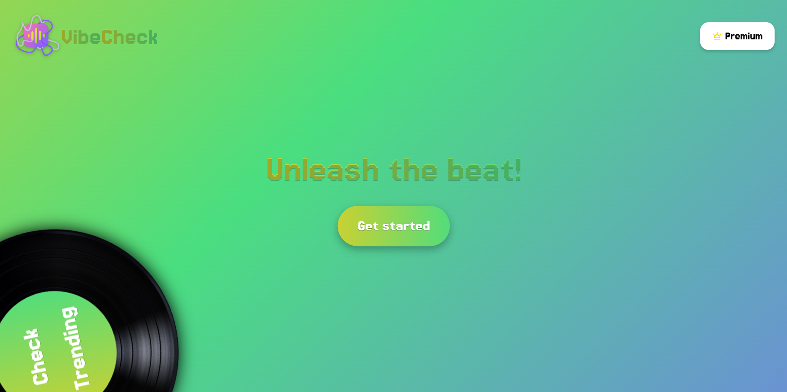
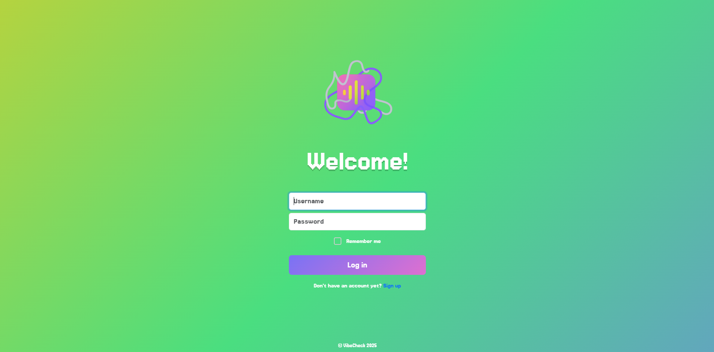
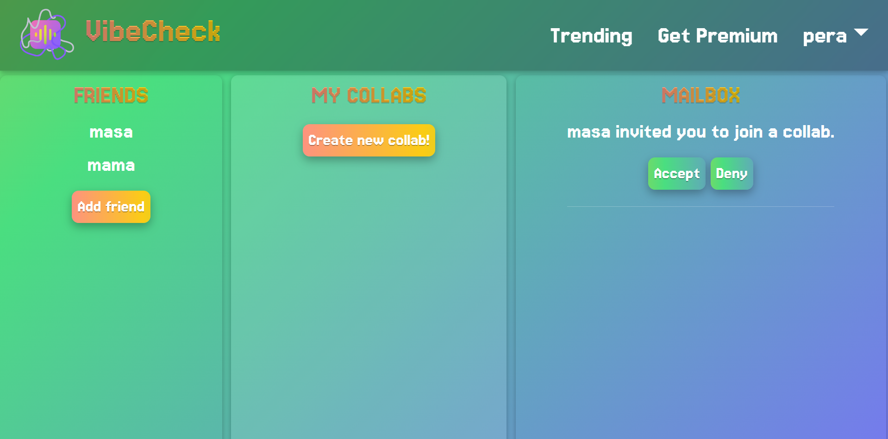
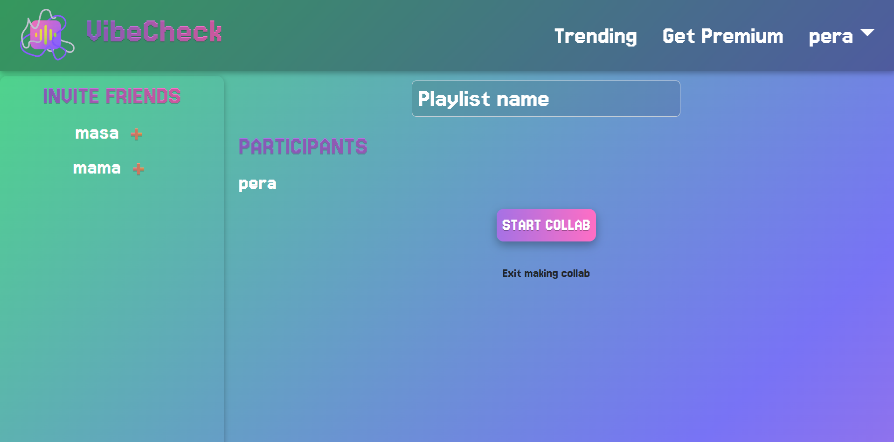
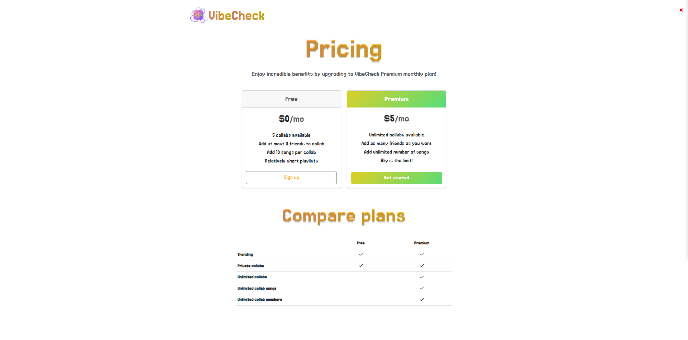
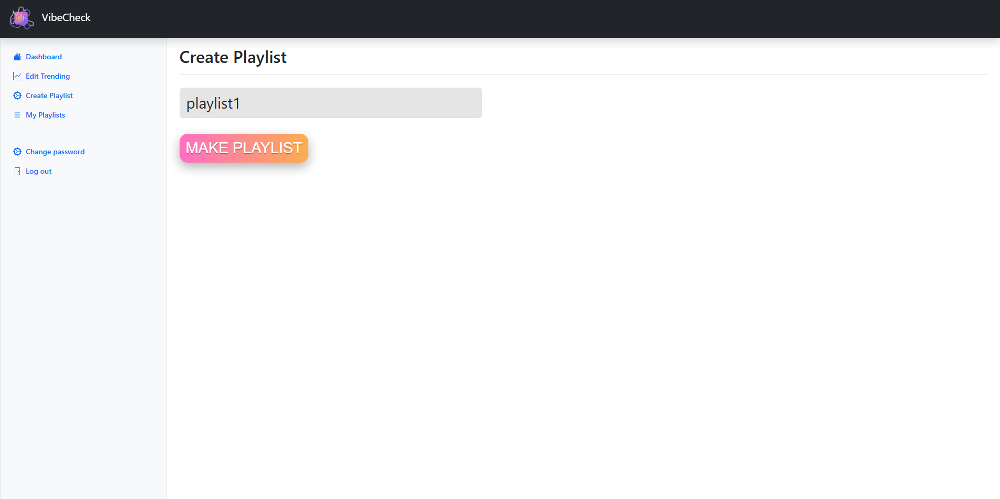

# VibeCheck 🎵

A collaborative playlist management web application that brings people together through music. Built with Django and Spotify API integration, VibeCheck enables users to create, share, and collaborate on playlists with friends in real-time.

> **Academic Project**: Developed as part of the Principles of Software Engineering course at the School of Electrical Engineering, University of Belgrade

## Team Members

- **Nikola Simikić** (2022/0281)
- **Maša Cvetanovski** (2022/0128)
- **Dušan Grabović** (2022/0099)

---

## Table of Contents

- [About](#about)
- [Key Features](#key-features)
- [Technology Stack](#technology-stack)
- [Architecture](#architecture)
- [Getting Started](#getting-started)
- [Project Structure](#project-structure)
- [Testing](#testing)
- [Screenshots](#screenshots)
- [What We Learned](#what-we-learned)

---

## About

VibeCheck is a social music platform that reimagines how people create and share playlists. Unlike traditional playlist apps, VibeCheck emphasizes collaboration, allowing users to work together on playlists in real-time, discover trending music collections, and manage a premium subscription model.

The application features a complete user management system with four distinct roles (Regular User, Premium User, Moderator and Admin), each with specific capabilities and permissions. Integration with the Spotify Web API enables seamless music search and playlist management.

### Project Scope

This project was developed following software engineering best practices, including:
- **Full software development lifecycle** documentation (requirements, design, implementation, testing)
- **UML modeling** (use case diagrams, class diagrams, sequence diagrams)
- **Database design** with comprehensive schema specification
- **Automated testing** with Selenium
- **Iterative development** from static prototype to full-stack application

---

## Key Features

### Core Functionality
- **User Authentication & Authorization** - Secure registration, login, and role-based access control
- **Collaborative Playlists (Collabs)** - Create and manage shared playlists with multiple contributors
- **Spotify Integration** - Search and add tracks from Spotify's vast music library
- **Social Features** - Friend system with requests, approvals, and social networking
- **Rating & Engagement** - Like and rate playlists to help surface quality content

### Premium Features
- **Subscription System** - 30-day premium memberships with checkout flow
- **Enhanced Capabilities** - Premium users unlock additional features and benefits

### Content Management
- **Trending Section** - Discover popular playlists curated by moderators
- **Mailbox System** - Real-time notifications for friend requests and collaboration invites
- **Statistics Dashboard** - Track engagement metrics and playlist performance

### Administration
- **Admin Panel** - Comprehensive system administration and user management
- **Moderator Tools** - Content curation and trending playlist management

---

## Tech Stack

### Backend
- **Django 4.2.25** - Python web framework
- **MySQL** - Relational database management
- **Django ORM** - Database abstraction and migrations
- **Django Authentication** - Built-in user management system

### Frontend
- **HTML5/CSS3** - Semantic markup and responsive styling
- **JavaScript** - Dynamic client-side interactions
- **AJAX** - Asynchronous server communication

### External APIs
- **Spotify Web API** - Music search and track metadata

### Development & Testing
- **Selenium WebDriver** - Automated end-to-end testing
- **Git (Gerrit)** - Version control
- **StarUML** - UML diagram creation
- **MySQL Workbench** - Database design and modeling

---

## Architecture

### Database Schema
The application uses a relational database with 12 core tables:
- **User Management**: `user`, `friendship`, `requestfriendship`
- **Playlist System**: `playlist`, `song`, `created`, `contains`
- **Collaboration**: `collab`, `participated`, `requestcollab`
- **Engagement**: `liked`, `rated`
- **Monetization**: `purchased`

### Application Structure
```
VibeCheck/
├── VibeCheck/          # Django project configuration
│   ├── settings.py     # Database, API keys, middleware config
│   ├── urls.py         # Main URL routing
│   └── wsgi.py         # WSGI deployment configuration
└── app/                # Main application
    ├── models.py       # Database models (model classes)
    ├── views.py        # Business logic and request handlers
    ├── urls.py         # Application URL patterns
    ├── templates/      # HTML templates (website pages)
    └── static/         # CSS, JavaScript, and assets
```

---

## Getting Started

### Prerequisites
- Python 3.9+
- MySQL Server
- Spotify Developer Account (for API credentials)
- Git

### Basic Setup

1. **Clone the repository**
   ```bash
   git clone https://github.com/yourusername/project_VibeCheck.git
   cd project_VibeCheck
   ```

2. **Set up MySQL database**
   - Create a database named `vibecheck`
   - Import the schema from `bazavibecheck/full_schema.sql`
   - Update database credentials in `django/VibeCheck/VibeCheck/settings.py`

3. **Configure Spotify API**
   - Create an app at [Spotify Developer Dashboard](https://developer.spotify.com/dashboard)
   - Add your Client ID and Client Secret to the Django settings

4. **Install dependencies and run**
   ```bash
   cd django/VibeCheck
   pip install django mysqlclient requests
   python manage.py migrate
   python manage.py runserver
   ```

5. **Access the application**
   - Navigate to `http://localhost:8000`
   - Test credentials available in `README.txt`

---

## Project Structure

```
project_VibeCheck/
├── django/                      # Django application
│   └── VibeCheck/
│       ├── app/                 # Main app with models, views, templates
│       └── VibeCheck/           # Project settings and configuration
├── Prototip/                    # Static HTML/CSS prototype
├── Selenium testovi/            # Automated test suite (Selenium IDE)
├── dijagrami/                   # UML diagrams (StarUML format)
│   ├── dijagrami.mdj            # Complete class and use case diagrams
│   ├── login.mdj                # Login sequence diagram
│   ├── dodavanje prijatelja.mdj # Add friend sequence diagram
│   └── promena lozinke.mdj      # Password change sequence diagram
├── bazavibecheck/               # Database files
│   ├── full_schema.sql          # Complete database schema
│   ├── SpecifikacijaBaze.doc    # Database specification document
│   └── baza_sa_podacima/        # Sample data dumps
└── SSU dokumenti/               # Software specification documents
```

---

## Testing

The project includes comprehensive Selenium automated tests covering all major user flows:

- User registration and authentication
- Password management
- Friend request workflows
- Collaborative playlist creation
- Song search and addition
- Rating and liking functionality
- Premium subscription purchase
- Admin and moderator operations

**Running Tests:**
```bash
# Tests are configured in Selenium IDE format
# Open VibeCheck.side in Selenium IDE to run the test suite
```

---

## Screenshots

### Landing Page
The homepage showcases VibeCheck's key features and value proposition.





### Authentication
Secure login system with user registration capabilities.



### User Dashboard
Main user interface showing playlists, friends, and activity feed.



### Collaborative Playlists
Real-time collaboration on shared playlists with friends.



### Playlist Creation
Create and manage playlists with Spotify integration.


### Premium Features
Subscription pricing and premium membership options.



### Moderator Dashboard
Content curation and trending playlist management tools.



---

## What We Learned

Through this project, our team gained hands-on experience with:

### Technical Skills
- **Full-stack web development** with Django framework
- **Database design** and normalization principles
- **RESTful API integration** (Spotify Web API)
- **Authentication & authorization** implementation
- **Automated testing** with Selenium
- **AJAX** for asynchronous web interactions

### Software Engineering Practices
- **Requirements engineering** and use case analysis
- **UML modeling** for system design
- **Database specification** and schema documentation
- **Version control** with Git
- **Iterative development** from prototype to production
- **Team collaboration** and project management

### Problem-Solving
- Managing complex many-to-many relationships in the database
- Implementing time-based premium subscription validation
- Handling real-time collaboration on shared playlists
- Ensuring data integrity with unique constraints and foreign keys

---

## Documentation

The project includes extensive documentation in Serbian:
- **Project Specification** - `VibeCheck_v1.1.pdf`
- **SSU Documents** - Detailed functional specifications for each feature
- **Database Specification** - Complete schema documentation
- **UML Diagrams** - System architecture and flow visualization

---

## Security Note

**This is an academic project with demonstration credentials**. The current configuration includes:
- Exposed Django secret key
- Hardcoded database credentials
- Debug mode enabled

**Before any production deployment, ensure:**
- Environment variables for sensitive data
- Secure credential management
- DEBUG = False in settings
- Proper HTTPS configuration

---

<div align="center">
Made with ❤️ and 🎵 by the VibeCheck Team
</div>
